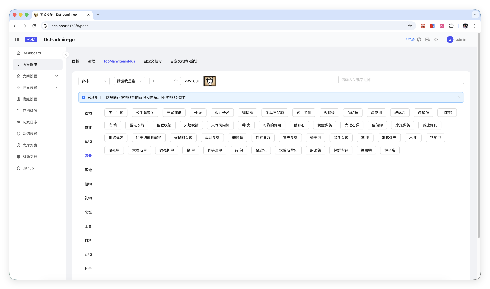
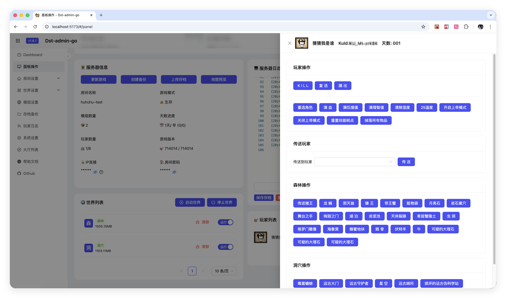
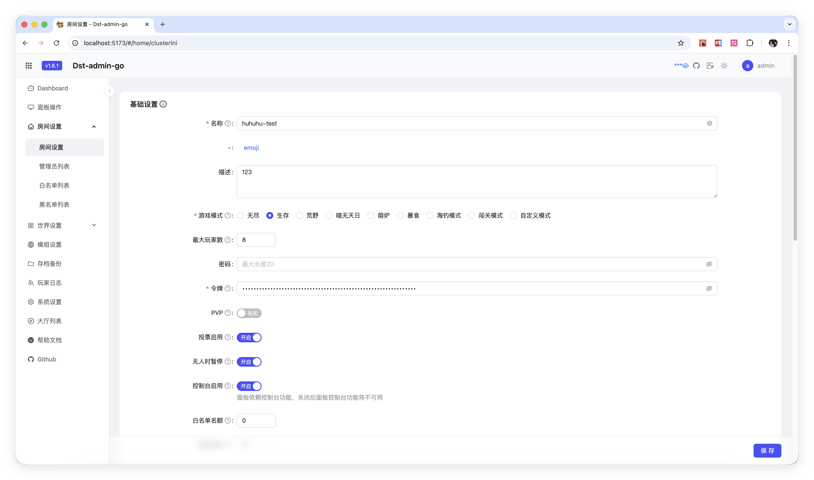
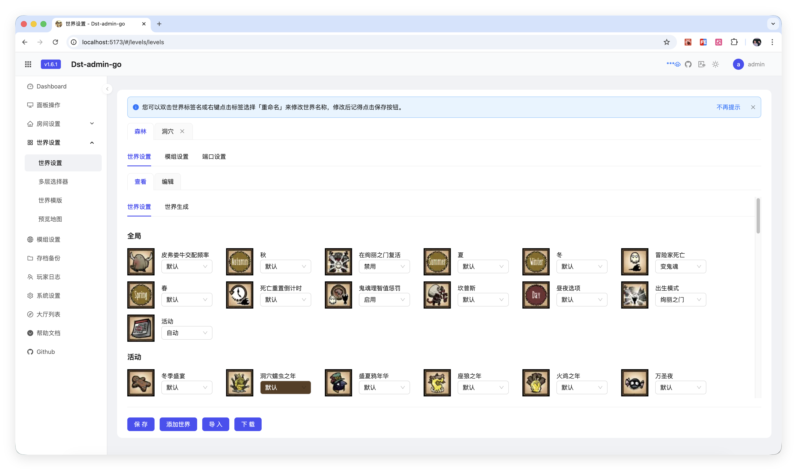
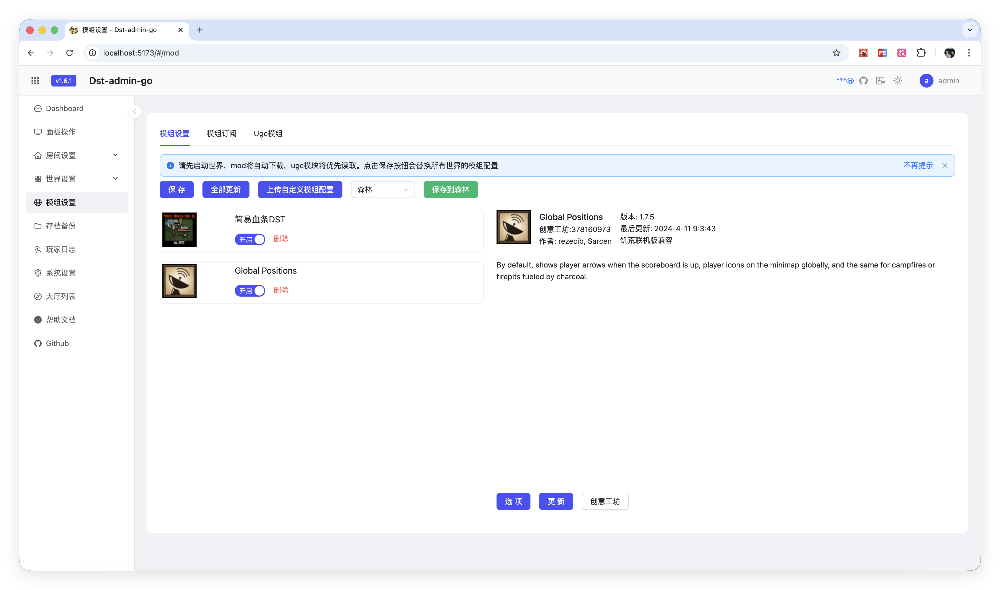
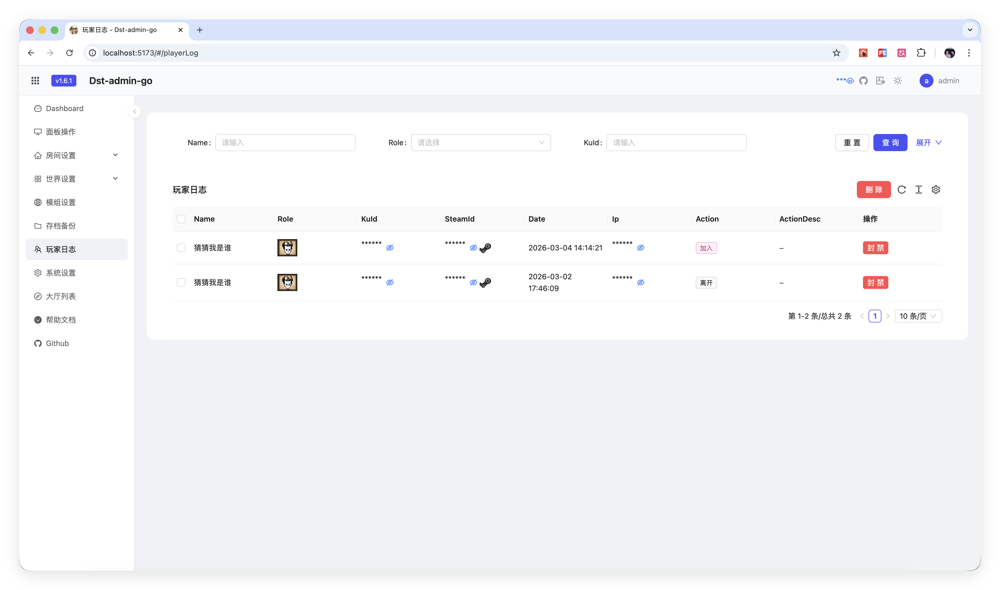

# dst-admin-go
> dst-admin-go manage web
>
> preview https://carrot-hu23.github.io/dst-admin-go-preview/

[English](README-EN.md)/[中文](README.md)

**Now supports both Windows and Linux platforms**

## About

DST Admin Go is a web-based management panel for "Don't Starve Together" dedicated servers, written in Go. Key features include:

- 🚀 **Easy Deployment**: Single executable binary, no complex configuration required
- 💾 **Low Resource Usage**: Built with Go, minimal memory footprint and high performance
- 🎨 **Modern UI**: Clean and intuitive web interface
- ⚙️ **Feature-Rich**:
  - Visual configuration for game rooms and world settings
  - Online mod management and configuration
  - Multi-cluster and multi-world support
  - Game save backup and snapshot restoration
  - Player management (whitelist, blacklist, administrators)
  - Real-time log viewing and game console access
  - Automatic game server update detection

## Preview













## Run

**Edit config.yml**
```yaml
# Bind address
bindAddress: ""
# Port
port: 8082
# Database
database: dst-db
```

Run
```bash
go mod tidy
go run cmd/server/main.go
```

## Build

### Build for Linux

```bash
bash scripts/build_linux.sh
# Output: dst-admin-go (Linux amd64 binary)
```

### Build for Windows

```bash
bash scripts/build_window.sh
# Output: dst-admin-go.exe (Windows amd64 binary)
```

### Cross-compile from Windows to Linux

```cmd
# Open cmd
set GOARCH=amd64
set GOOS=linux
go build -o dst-admin-go cmd/server/main.go
```

## QQ Group
