# dst-admin-go
> Panel de administración web para dst-admin-go
>
> Vista previa https://carrot-hu23.github.io/dst-admin-go-preview/

[English](README-EN.md)/[中文](README.md)/[Español](README-ES.md)

**Ahora soporta plataformas Windows y Linux**

## Acerca de

DST Admin Go es un panel de administración web para servidores dedicados de "Don't Starve Together", escrito en Go. Características principales:

- 🚀 **Despliegue sencillo**: Un único binario ejecutable, sin configuración compleja
- 💾 **Bajo consumo de recursos**: Desarrollado en Go, huella de memoria mínima y alto rendimiento
- 🎨 **Interfaz moderna**: Interfaz web limpia e intuitiva
- ⚙️ **Repleto de funciones**:
  - Configuración visual de las salas y los parámetros del mundo
  - Gestión y configuración de mods en línea
  - Soporte para múltiples clústeres y múltiples mundos
  - Copias de seguridad de partidas y restauración de snapshots
  - Gestión de jugadores (lista blanca, lista negra, administradores)
  - Visualización de logs en tiempo real y consola del juego
  - Detección automática de actualizaciones del servidor del juego

## Vista previa

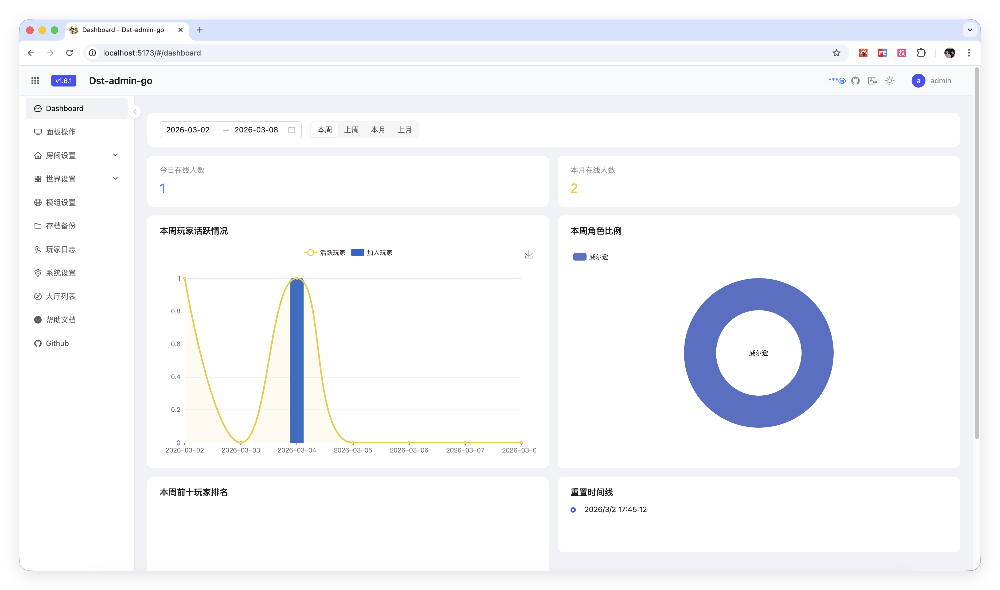
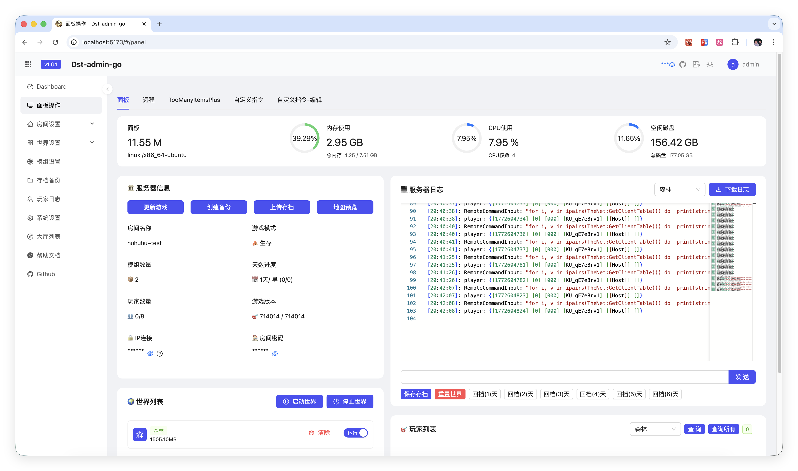
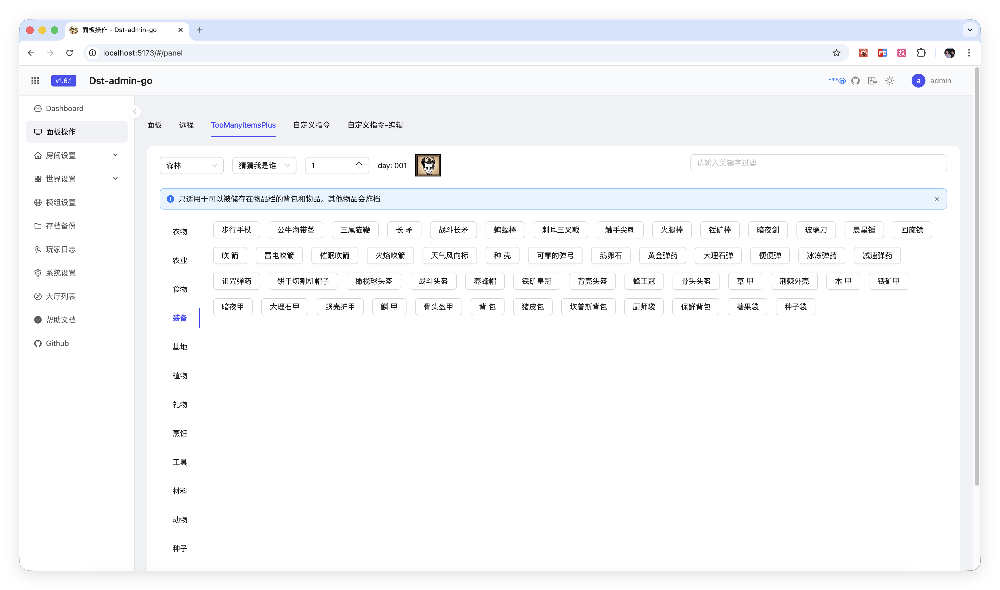
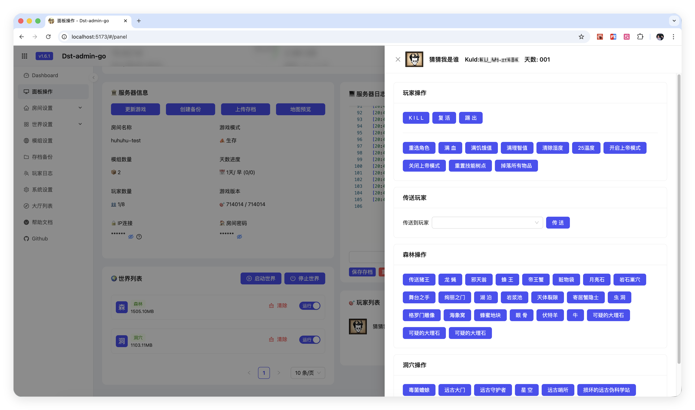
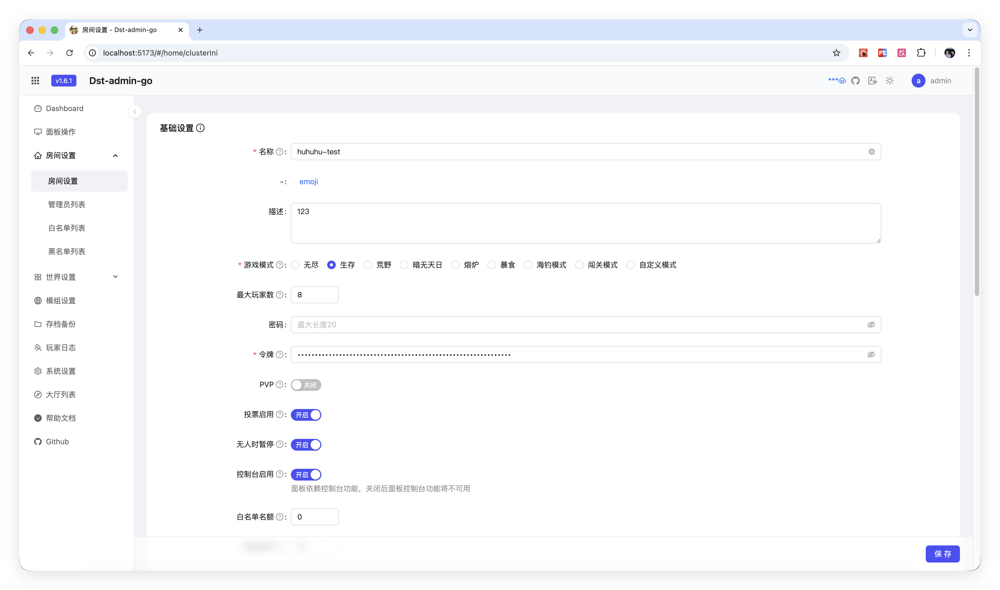
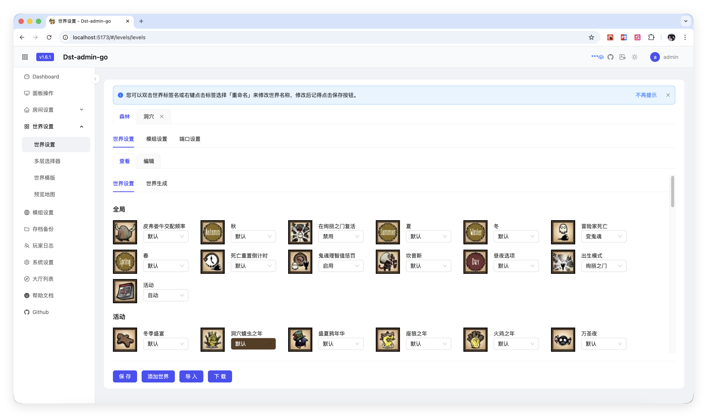
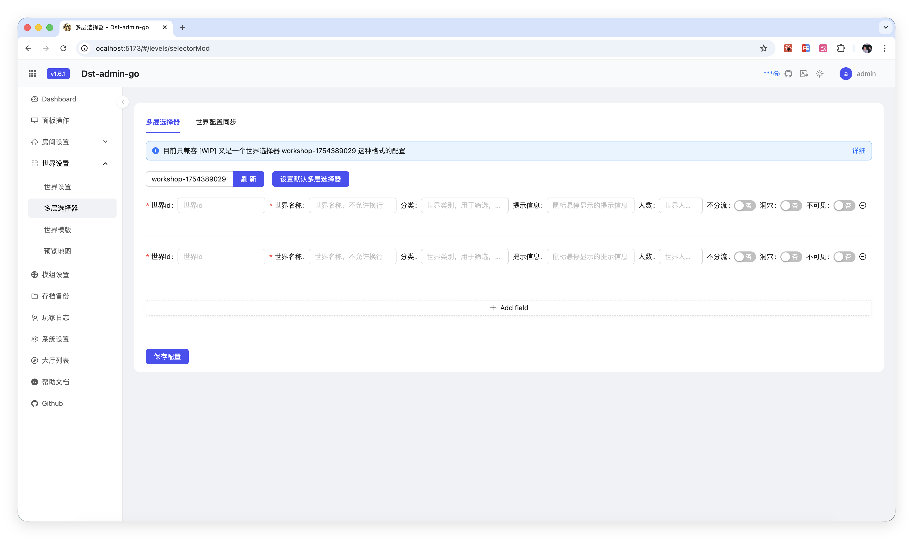
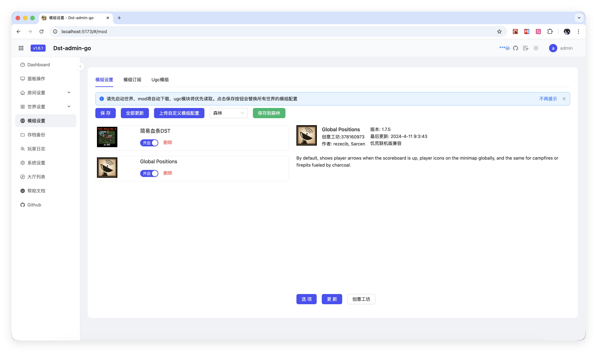
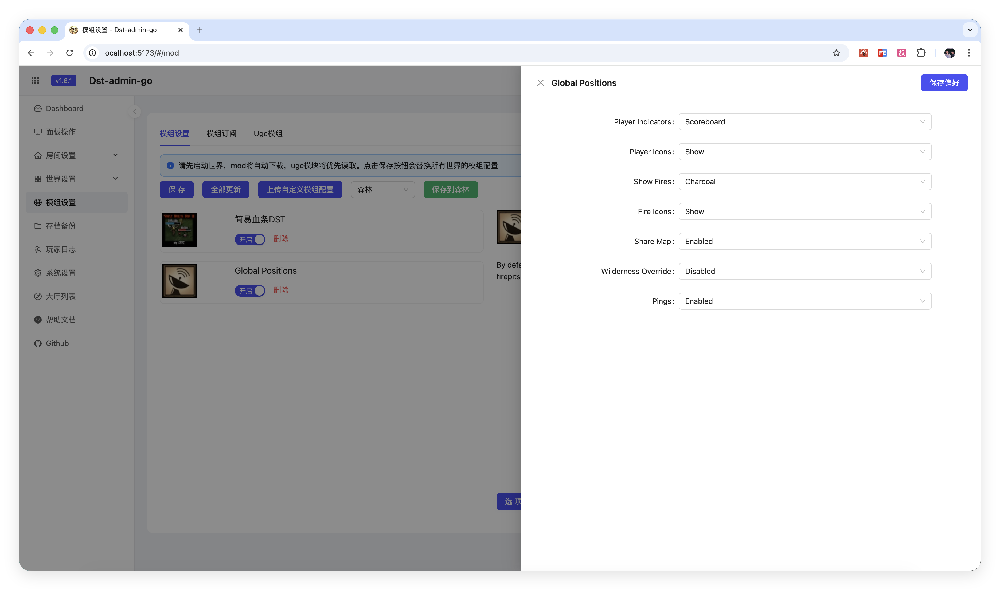
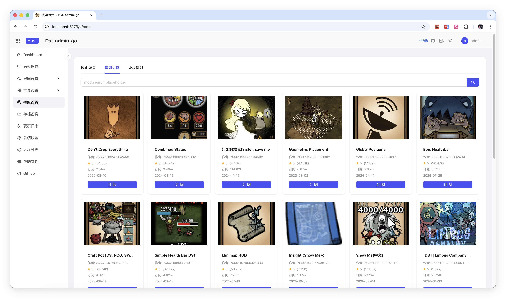
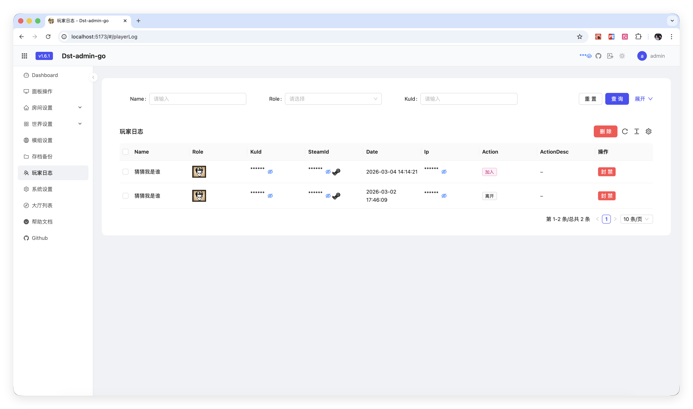
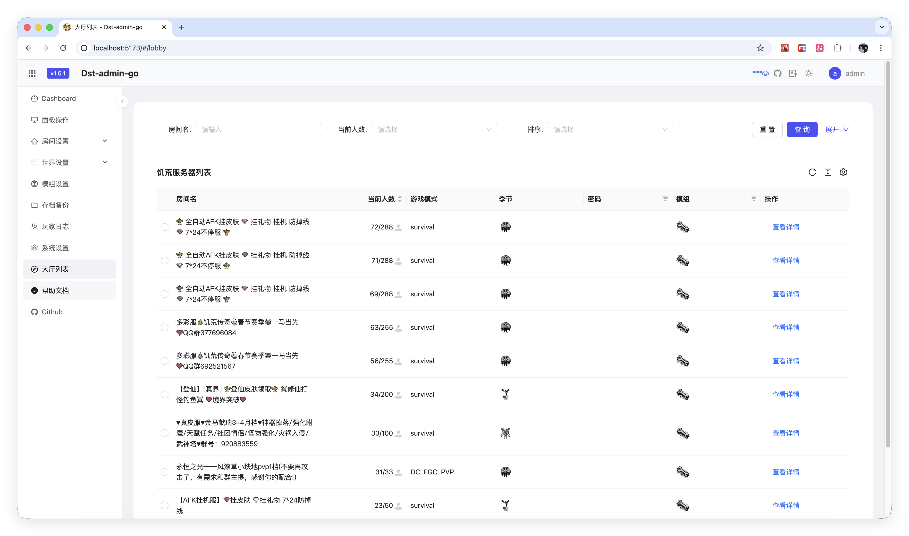


## Ejecución

**Edita config.yml**
```yaml
# Dirección de bind
bindAddress: ""
# Puerto
port: 8082
# Base de datos
database: dst-db
```

Ejecutar
```bash
go mod tidy
go run cmd/server/main.go
```

## Compilación

### Compilar para Linux

```bash
bash scripts/build_linux.sh
# Salida: dst-admin-go (binario Linux amd64)
```

### Compilar para Windows

```bash
bash scripts/build_window.sh
# Salida: dst-admin-go.exe (binario Windows amd64)
```

### Compilación cruzada de Windows a Linux

```cmd
# Abrir cmd
set GOARCH=amd64
set GOOS=linux
go build -o dst-admin-go cmd/server/main.go
```

## Contenedor (Docker)

Cada release publica una imagen multiplataforma en GHCR, lista para ejecutarse en cualquier host
con Docker o Podman (incluido Debian) sin necesidad de instalar Go ni Node:

```bash
docker pull ghcr.io/<owner>/dst-admin-go:latest
```

Consulta [`scripts/docker/README.md`](scripts/docker/README.md) para variables de entorno, volúmenes
recomendados y un ejemplo de `docker-compose.yml`.

## Grupo de QQ

