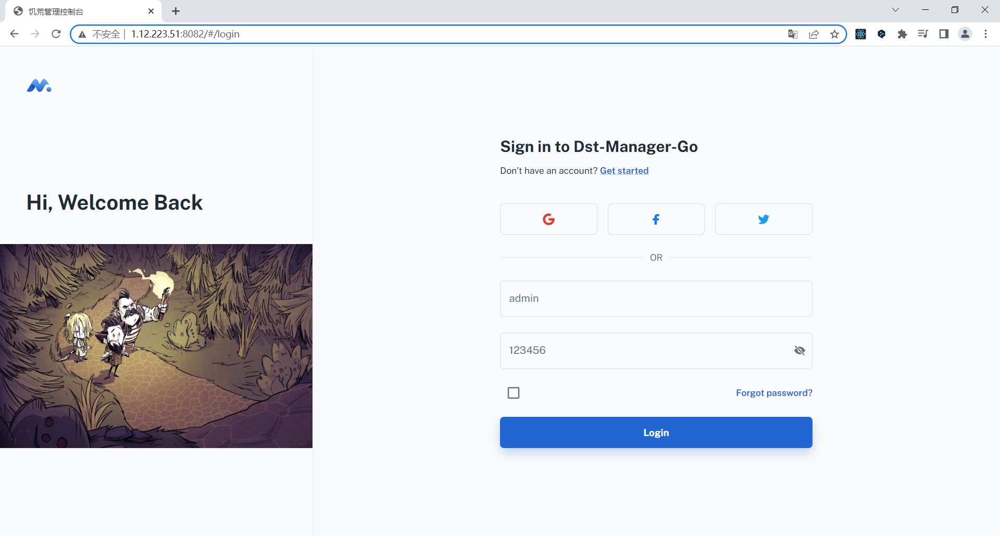
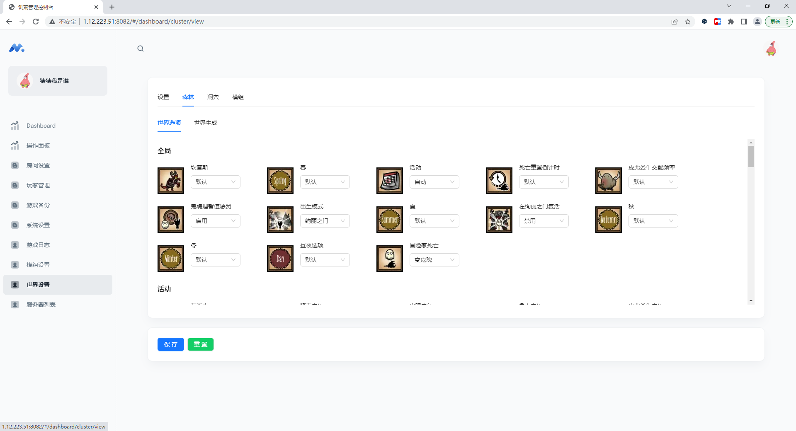
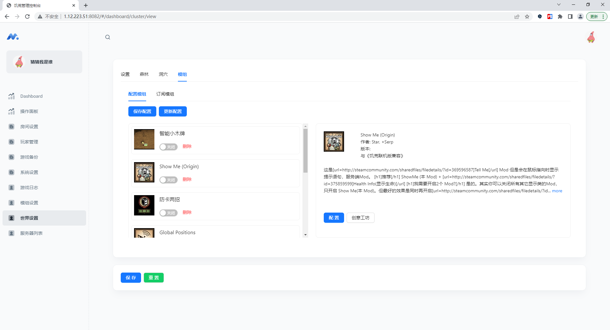

# dst-admin-go
> 饥荒联机版管理后台Go版本
>
> Date: 2023/05/11

在线预览地址 http://1.12.223.51:8080/ （admin 123456）

使用go编写的饥荒管理面板,部署简单,占用内存少,界面美观,操作简单,提供可视化界面操作房间配置和模组在线配置,支持多房间管理

## 部署

**目前多房间版本还有些bug没有修复， 萌新勿用**

注意目录必须要有读写权限。
### 二进制部署
+ 1.1.6(单房间部署)
  
    [萌新部署教程](https://blog.csdn.net/Dig_hoof/article/details/131296762)

+ 2.0.0.beta

  点击查看 [多房间部署文档](./doc/install.md)

### docker 部署
此版本是单房间版本
```
docker pull hujinbo23/dst-admin-go
docker run -d -p8082:8082 hujinbo23/dst-admin-go
```
**阿里云镜像仓库**

```text
docker pull 
registry.cn-hangzhou.aliyuncs.com/hujinbo23/dst-admin-go:1.1.6

docker run -d -p8082:8082 registry.cn-hangzhou.aliyuncs.com/hujinbo23/dst-admin-go:1.1.6

```

## 预览






    

## 运行

**修改config.yml**
```
#端口
port: 8082
database: dst-db
```


运行
```
go mod tidy
go run main.go
```

## 打包


### window 打包

window 下打包 Linux 二进制 

```
打开 cmd
set GOARCH=amd64
set GOOS=linux

go build
```

## QQ群 反馈交流
