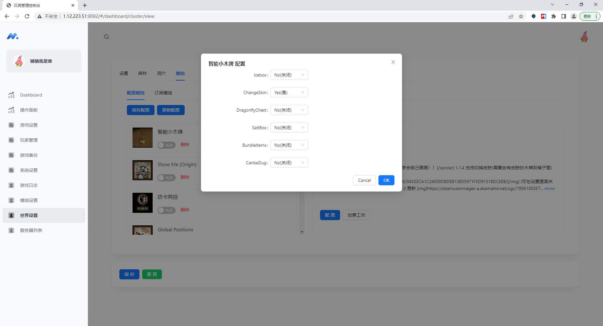
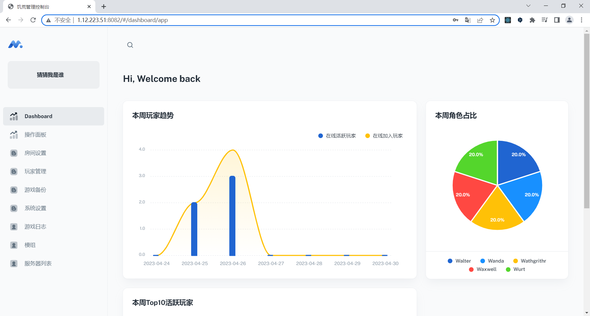
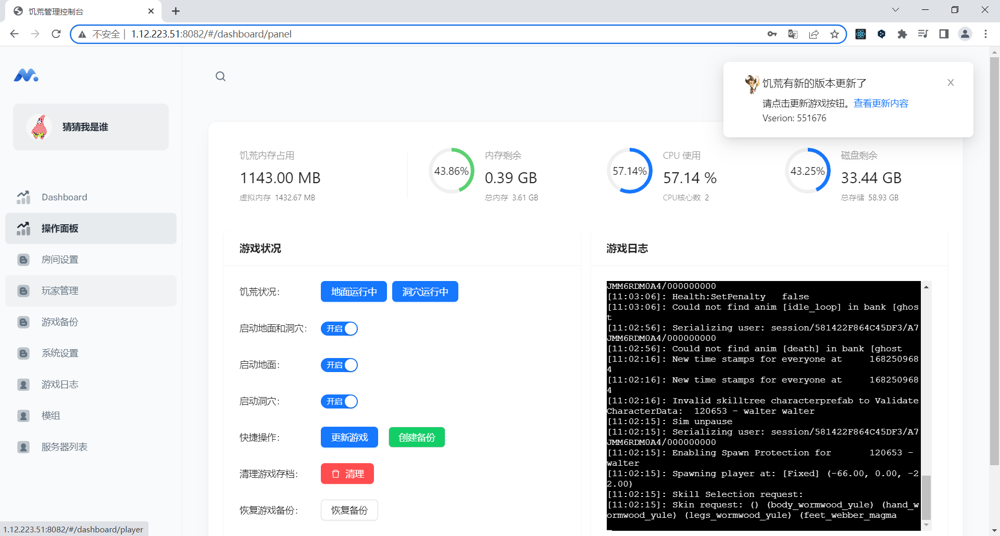
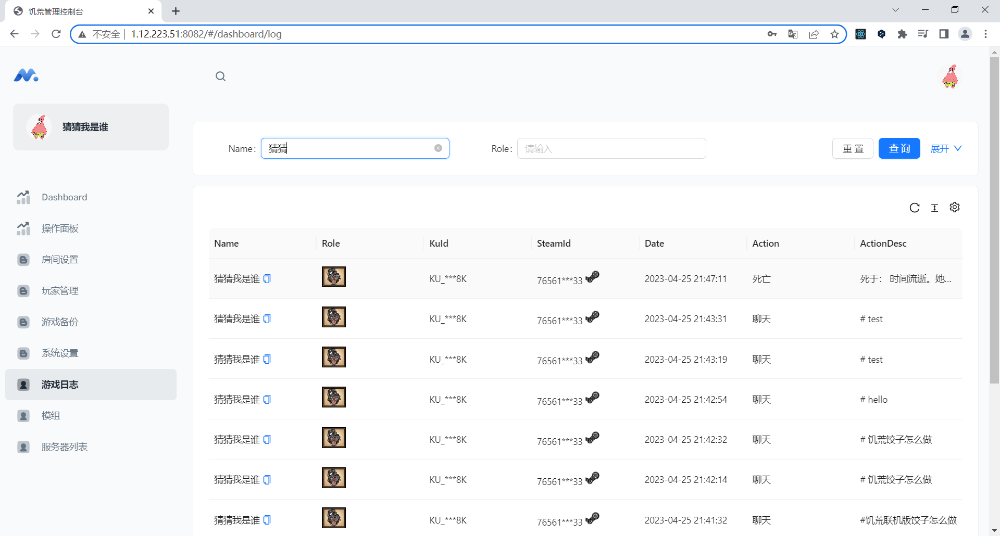

# dst-admin-go
> 饥荒联机版管理后台Go版本
>
> Date: 2023/05/11


## 部署
注意目录必须要有读写权限。点击查看 [部署文档](./install.md)

## 预览

在线预览地址 http://1.12.223.51:8082/
（admin 123456）






    

## 运行

**修改config.yml**
```
#端口
port: 8082
db: dst-db
#监听日志路径
path: /root/.klei/DoNotStarveTogether/MyDediServer
```

**修改dst_config**（也可以通过页面修改）
```
# steamcmd 位置
steamcmd=/root/steamcmd/
# steamcmd 饥荒安装的位置
force_install_dir=/root/dst/
# 要启动的服务器
cluster=cluster2
# 游戏备份的路径
backup=C:\Users\xm\Desktop\饥荒配置文件和建家截图\饥荒存储备份\backup
# 游戏mod下载的路径
mod_download_path=/download_mod
```

运行
>由于window sqlite3 依赖gcc，请自行下载安装，更多详细点击查看 
 [sqlite3](https://github.com/mattn/go-sqlite3#windows)
```
go mod tidy
go run main.go
```

## 打包

### Linux 打包
```sh
go build
```

### window 打包

window 下打包 Linux 二进制 

```
打开 cmd
set GOARCH=amd64
set GOOS=linux

go build
```
